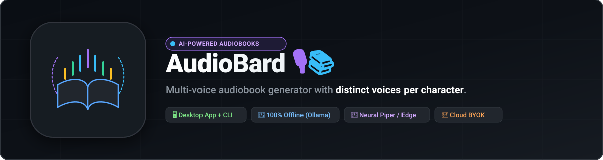

<p align="center">
  
</p>

<p align="center">
  <a href="https://github.com/oscarbol09/audiobard/actions/workflows/ci.yml"></a>
  <a href="pyproject.toml"></a>
  <a href="https://tauri.app/"></a>
  <a href="https://ollama.com/"></a>
  <a href="LICENSE"></a>
  <a href="https://github.com/oscarbol09/audiobard/issues?q=is%3Aissue+is%3Aopen+label%3A%22good+first+issue%22"></a>
  <a href="https://github.com/oscarbol09/audiobard"></a>
</p>

---

## ⚡ The Problem: The "Monotone TTS & Expensive Cloud" Friction

Every audiobook listener and developer who has tried generating audiobooks from EPUBs or public domain texts knows the pain:

```text
1. Standard TTS tools (Calibre, basic readers):
   └── Read the entire book in a single, robotic monotone voice. No character distinction.
2. Commercial AI Voice Platforms (ElevenLabs, Speechify):
   └── Require uploading private files to the cloud, charging $50–$100+/mo per book.
3. Manual Voice Acting / Splicing:
   └── Takes dozens of hours of manual audio editing and timeline alignment.
```

---

## 🚀 The Solution: AudioBard

**AudioBard** turns EPUB and TXT books into **multi-voice, cast-narrated audiobooks** with distinct voices per character. It runs **100% locally and offline** with zero cloud dependency, or via **BYOK (Bring Your Own Key)** cloud APIs.

<p align="center">
  
</p>

### Key Highlights
- 🎭 **AI Character Casting & Dialogue Attribution:** Uses LLMs to detect who speaks each line, track aliases across chapters, and determine vocal emotion.
- 🎙️ **Multi-Voice Synthesis:** Automatically maps distinct neural voices (via Piper TTS or Edge TTS) to every character based on gender, age, and emotional tone.
- 📴 **100% Local & Offline:** Complete privacy with [Ollama](https://ollama.com) (`qwen2.5:7b`, `llama3.3:70b`) + [Piper TTS](https://github.com/rhasspy/piper) (fast CPU neural voice). Zero data leaves your machine.
- 🔑 **Cloud BYOK Fallback:** Support for NVIDIA NIM, OpenRouter, and Google Gemini with your own API keys for low-resource laptops.
- 🖥️ **Native Desktop GUI & CLI:** Built with Tauri v2 + Vue 3, featuring drag & drop book ingestion, library player, and Spanish 🇪🇸 / English 🇺🇸 i18n.

---

## 🆚 Why AudioBard? (Comparison)

| Feature | **AudioBard** 🎙️ | **ElevenLabs** | **Speechify** | **Storyteller** | **Calibre TTS** |
| :--- | :---: | :---: | :---: | :---: | :---: |
| **100% Local / Offline** | ✅ **Yes (Ollama+Piper)** | ❌ Cloud Only | ❌ Cloud Only | 🟡 Self-hosted Server | ✅ Yes |
| **Multi-Voice Character Casting** | ✅ **Yes (LLM)** | 🟡 Manual Studio | ❌ No | 🟡 Basic | ❌ Single Voice |
| **Native Desktop App (Tauri v2)** | ✅ **Yes** | ❌ Web Only | 🟡 Web/Mobile | ❌ Web Server | 🟡 Qt Desktop |
| **Cost / Licensing** | 💚 **Free & MIT** | 💳 $50+/mo | 💳 $139/yr | 💚 Open Source | 💚 GPL |
| **Cloud BYOK Support** | ✅ **Yes (Gemini/NIM)** | ❌ No | ❌ No | ❌ No | ❌ No |
| **Dialogue Attribution Benchmarks** | ✅ **Yes (Gold Standard)** | ❌ N/A | ❌ N/A | ❌ No | ❌ No |

---

## 🛠️ Quickstart

### 🖥️ Desktop GUI Application (Tauri v2 + Vue 3)

```bash
# Clone and install Python dependencies
git clone https://github.com/oscarbol09/audiobard.git
cd audiobard
pip install -e ".[dev,llm-gemini,llm-ollama,tts-piper]"

# Launch the Desktop GUI
cargo tauri dev
```

The Desktop GUI features:
- 📄 **Drag & Drop Upload:** Drop any `.txt` or `.epub` file to immediately extract cast and chapters.
- 🌐 **Multi-Language UI (i18n):** Instant toggle between Spanish (🇪🇸) and English (🇺🇸).
- ⚙️ **BYOK Settings Modal:** Configure API keys, local models, audio quality, and cache settings.
- 📚 **Personal Audiobook Library:** Search, play, or regenerate previously converted audiobooks.

### 💻 Command Line Interface (CLI)

```bash
# Generate a multi-voice audiobook via CLI
audiobard generate book.epub --output audiobook.mp3

# Dry-run test (character extraction & attribution without audio synthesis)
audiobard generate book.epub --dry-run
```

---

## 📖 Companion Tools

### 📖 [PDF2Bard](https://github.com/oscarbol09/pdf2bard) — PDF to EPUB Converter for AudioBard

AudioBard accepts **EPUB** and **TXT** files natively. If your book is currently in **PDF format**, use our dedicated companion converter:

👉 [**PDF2Bard (`oscarbol09/pdf2bard`)**](https://github.com/oscarbol09/pdf2bard)

- 🧩 **Smart Paragraph Reflow:** Unwraps hard visual line breaks while respecting genuine paragraph and dialogue boundaries.
- ✂️ **Automatic De-Hyphenation:** Reconnects split words across margins without altering legitimate hyphenated words.
- 🧹 **Header & Footer Stripper:** Detects and strips page numbers, running headers, and disclaimers so the narrator doesn't read them aloud.
- 💬 **Dialogue Integrity:** Preserves and normalizes em-dashes (`—`), guillemets (`«»`), and quotes for character attribution.

---

## 📖 Command & App Reference

| Command / Interface | What it does |
|---|---|
| `cargo tauri dev` | Launch the Desktop GUI in development mode |
| `cargo tauri build` | Build standalone desktop executable installer (`.exe` / `.msi` / `.dmg` / `.AppImage`) |
| `audiobard generate <book> -o <out>` | Full CLI pipeline: parse → attribute → synthesize → assemble |
| `audiobard generate <book> --dry-run` | Parse + LLM attribution only — no synthesis (fast prompt iteration) |
| `audiobard doctor` | Check environment, dependencies, FFmpeg, Piper, Ollama, API keys, and cache |
| `audiobard benchmark --llm <provider>` | Attribution accuracy against the gold standard (see [eval/README.md](eval/README.md)) |
| `audiobard stats` | Cache hit rate, books processed, and disk cache usage |
| `audiobard voices --locale en_US` | List available TTS voices for a locale |
| `audiobard validate-config` | Check config, providers, and ethics guardrails |

---

## 📁 Repository Structure

```text
audiobard/
├── src/audiobard/
│   ├── cli.py                    # CLI entry point (Typer app)
│   ├── config.py                 # Pydantic settings
│   ├── doctor.py                 # Environment diagnostics
│   ├── parser/                   # TXT/EPUB parsers (BookParser ABC)
│   ├── llm/                      # LLM clients (LLMClient ABC) + versioned prompts
│   ├── tts/                      # TTS providers (TTSProvider ABC) + voice mapper
│   ├── audio/                    # Audio assembly (pydub/ffmpeg)
│   ├── pipeline.py               # Orchestrator
│   └── persistence.py            # SQLite: speakers, voices, cache, runs
├── gui/                          # Vue 3 + Tailwind CSS frontend
├── src-tauri/                    # Tauri v2 native desktop application wrapper
├── tests/                        # pytest suite (236+ unit & integration tests)
├── eval/
│   ├── gold_standard/            # Hand-labeled dialog attribution (immutable)
│   └── benchmark.py              # Accuracy scorer
├── data/
│   ├── books/                    # Sample books (gitignored — public domain only)
│   └── voices/                   # Regional voice metadata pools (en_US, es_MX, es_CO, es_ES)
├── tools/
│   ├── guards.py                 # Security & supply-chain guards run by CI
│   └── lint_skills.py            # Prompt/skill linting
├── .github/workflows/            # CI, benchmark, desktop releases
└── docs/                         # Provider and prompt-engineering guides
```

---

## ⚙️ How It Works (Step-by-Step)

The `generate` command runs the pipeline:

1. **Parse** — TXT/EPUB → paragraphs with chapter and line metadata; Project Gutenberg headers/footers stripped.
2. **Extract characters** *(LLM)* — the LLM returns canonical IDs (`Character_A`, …), aliases, tone, and gender/age hints, validated against a Pydantic schema.
3. **Assign voices** — voices are chosen from a **tone-aware pool**: filtered by gender/age first, scored by tone similarity, with a deterministic hash tie-break so the same book always maps to the same voices.
4. **Attribute dialog** *(LLM, chunked)* — every line gets a speaker + emotion; chunks of ~1500 words with a 5-paragraph sliding window resolve ambiguous attribution; results validated by Pydantic (drop-and-retry on schema mismatch).
5. **Synthesize** *(TTS, async)* — per-line speech with emotion→prosody mapping (rate/pitch/pause), local disk cache keyed by `(text, voice, emotion)`.
6. **Assemble** — clips joined with configurable silence gaps, volume normalized, exported as MP3 or M4B with chapter metadata.

---

## 🧩 Extension Model: Adding a New Provider

External dependencies are pluggable by design, with zero code changes — just config:

```yaml
# config.yaml
llm:
  provider: ollama        # ollama | gemini | openrouter | nim
  model: qwen2.5:7b
tts:
  provider: piper         # piper | edge
  locale: en_US
```

- **`LLMClient`** — `ollama_client` (offline, primary), `gemini_client` (opt-in cloud), `openrouter_client` (fallback), `nim_client` (NVIDIA NIM).
- **`TTSProvider`** — `piper_provider` (offline, primary), `edge_provider` (opt-in cloud).
- **`BookParser`** — `text_parser`, `epub_parser`.

---

## 🤝 Contributing & Community

Thinking about a PR? Read [CONTRIBUTING.md](CONTRIBUTING.md) first — it states the one rule everything follows from, what gets merged, and why. All contributions are governed by our [Code of Conduct](CODE_OF_CONDUCT.md).

- **New Contributors:** Check our [`good first issue`](https://github.com/oscarbol09/audiobard/labels/good%20first%20issue) label for onboarding tasks.
- **Provider Proposals:** Open an RFC for new TTS engines (Kokoro, Coqui) or LLM clients using our [Provider Proposal Template](.github/ISSUE_TEMPLATE/provider_proposal.md).

---

## 🏆 Contributors

Thank you to all the wonderful developers who contribute to AudioBard!

<!-- ALL-CONTRIBUTORS-LIST:START - Do not remove or modify this section -->
<!-- ALL-CONTRIBUTORS-LIST:END -->

---

## ⭐ Support & Star History

If you love the idea of free, local-first, multi-voice audiobooks, please consider starring the repository! It helps more book lovers discover the project.

<p align="center">
  <a href="https://github.com/oscarbol09/audiobard">
    
  </a>
</p>

---

## 💖 Sponsorship

- 💖 **[Sponsor on GitHub Sponsors](https://github.com/sponsors/oscarbol09)**
- ☕ **[Support on Ko-Fi](https://ko-fi.com/oscarmb09)**

---

## ⚖️ Ethics, Copyright & Legal Disclaimer

**AudioBard is designed exclusively for public-domain works** (e.g., Project Gutenberg, LibriVox, Standard Ebooks). The user is solely responsible for verifying the copyright status of any text before processing it.

- Voice cloning without consent, DRM circumvention, and bulk spam generation are strictly prohibited.
- The tool is provided "as is" under the MIT License — see [LICENSE](LICENSE).

---

## 📄 License

MIT — see [LICENSE](LICENSE). The gold standard dataset (`eval/gold_standard/`) is CC0.