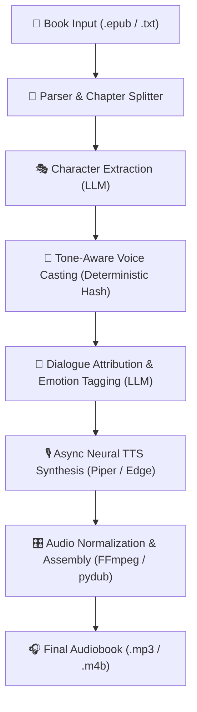

# Overview & Architecture 🏗️

AudioBard is designed with an anti-fragile, local-first architecture that treats privacy, deterministic output, and audio quality as first-class citizens.

---

## 🔄 The 6-Stage Pipeline

When you process a book through AudioBard (either via the Desktop GUI or the CLI `generate` command), it passes through six decoupled stages:

---

## 🧩 Stage-by-Stage Breakdown

### 1. Ingestion & Pre-Processing
- Accepts `.epub` and `.txt` files.
- Strips Project Gutenberg disclaimers, headers, and license footers.
- Preserves paragraph formatting and dialog punctuation (`—`, `«»`, `"`).

### 2. Character Roster Extraction
- Feeds the opening ~5,000 words of the text into the configured LLM.
- Returns a structured JSON roster of characters, including:
  - `canonical_id` (e.g., `Character_Elizabeth_Bennet`)
  - `aliases` (e.g., `["Lizzy", "Miss Bennet", "Elizabeth"]`)
  - `gender_hint` and `age_hint`
  - `tone` / temperament descriptor
- Validated via Pydantic schemas.

### 3. Tone-Aware Voice Casting
- Matches extracted characters against the available voice pool for the target locale (`en_US`, `es_MX`, `es_ES`, `es_CO`).
- Filters by gender and age hints.
- Computes semantic similarity between character tone and voice profile tags.
- Uses a deterministic hash tie-breaker so subsequent runs of the same book assign identical voices.

### 4. Sliding-Window Dialogue Attribution
- Splits the manuscript into ~1,500-word chunks with a 5-paragraph overlapping window.
- The LLM attributes each sentence to a character or `"Narrator"`.
- Assigns an emotion tag (`neutral`, `happy`, `sad`, `angry`, `whisper`, `surprised`, `sarcastic`).

### 5. Async Neural TTS Synthesis
- Synthesizes speech per line with prosody adjustments (speed, pitch, pauses) based on emotion.
- Multi-layer caching: In-memory LRU + SQLite persistent disk cache (`~/.cache/audiobard/tts/`).
- Only uncached lines call the TTS engine.

### 6. Assembly & Mastering
- Normalizes volume across distinct voices to prevent loudness jumping.
- Injects configurable silence gaps between narrator descriptions and spoken lines.
- Exports to standalone `.mp3` or chapter-tagged `.m4b`.
