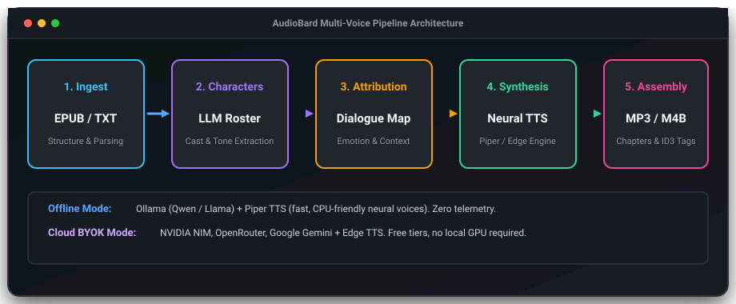

# AudioBard 🎙️

> **100% Local & Multi-Voice Audiobook Generator using AI Character Casting.**  
> Transform EPUB and TXT books into rich, cast-narrated audiobooks with distinct voices per character — completely offline or via BYOK cloud models.

---

<p align="center">
  
</p>

---

## ⚡ The Problem: Monotone TTS & Expensive Cloud Platforms

Every audiobook listener and developer who has tried converting digital books into audiobooks faces standard roadblocks:

```text
1. Standard TTS Tools (Calibre, basic screen readers):
   └── Reads every book in a single robotic monotone voice. No character distinction.
2. Commercial AI Voice Platforms (ElevenLabs, Speechify):
   └── Requires uploading private files to the cloud; costs $50–$100+/mo per book.
3. Manual Voice Acting & DAW Splicing:
   └── Demands dozens of hours of manual audio editing, cut-and-paste, and timeline alignment.
```

---

## 🚀 The Solution: AudioBard

**AudioBard** bridges the gap between single-voice robotic TTS and expensive cloud voice studios. Using local LLMs (via [Ollama](https://ollama.com)) for speaker extraction and dialogue attribution, and fast neural TTS engines (via [Piper](https://github.com/rhasspy/piper) or Edge TTS), AudioBard automatically casts every character with a fitting voice and produces production-ready audiobooks.

<p align="center">
  
</p>

### 🌟 Key Highlights

* 🎭 **AI Character Casting & Dialogue Attribution:** Uses LLMs to detect who speaks each line, track aliases across chapters, and determine vocal emotion.
* 🎙️ **Multi-Voice Neural Synthesis:** Automatically maps distinct neural voices (via Piper TTS or Edge TTS) to every character based on gender, age, and emotional tone.
* 📴 **100% Local & Offline:** Complete privacy with [Ollama](https://ollama.com) (`qwen2.5:7b`, `llama3.3:70b`) + [Piper TTS](https://github.com/rhasspy/piper) (fast CPU neural voice). Zero data leaves your machine.
* 🔑 **Cloud BYOK Fallback:** Native support for NVIDIA NIM, OpenRouter, and Google Gemini with your own API keys for low-resource laptops.
* 🖥️ **Native Desktop GUI & CLI:** Built with Tauri v2 + Vue 3, featuring drag & drop book ingestion, library player, and Spanish 🇪🇸 / English 🇺🇸 i18n.

---

## 🆚 Why AudioBard? (Feature Matrix)

| Feature | **AudioBard** 🎙️ | **ElevenLabs** | **Speechify** | **Storyteller** | **Calibre TTS** |
| :--- | :---: | :---: | :---: | :---: | :---: |
| **100% Local / Offline** | ✅ **Yes (Ollama+Piper)** | ❌ Cloud Only | ❌ Cloud Only | 🟡 Self-hosted Server | ✅ Yes |
| **Multi-Voice Character Casting** | ✅ **Yes (LLM)** | 🟡 Manual Studio | ❌ No | 🟡 Basic | ❌ Single Voice |
| **Native Desktop App (Tauri v2)** | ✅ **Yes** | ❌ Web Only | 🟡 Web/Mobile | ❌ Web Server | 🟡 Qt Desktop |
| **Cost / Licensing** | 💚 **Free & MIT** | 💳 $50+/mo | 💳 $139/yr | 💚 Open Source | 💚 GPL |
| **Cloud BYOK Support** | ✅ **Yes (Gemini/NIM)** | ❌ No | ❌ No | ❌ No | ❌ No |
| **Dialogue Attribution Benchmarks** | ✅ **Yes (Gold Standard)** | ❌ N/A | ❌ N/A | ❌ No | ❌ No |

---

## 🧭 Navigation & Next Steps

- **[Overview & Architecture](getting-started/overview.md)** — Learn how AudioBard's 6-stage audio pipeline works under the hood.
- **[Installation Guide](getting-started/installation.md)** — Step-by-step setup for Python, Ollama, Piper, and Tauri.
- **[Quickstart Tutorial](getting-started/quickstart.md)** — Generate your first audiobook via GUI or CLI in under 5 minutes.
- **[Supported Providers](guides/providers.md)** — Deep dive into LLM and TTS backends (Ollama, Piper, Gemini, NIM, OpenRouter, Edge TTS).
- **[PDF2Bard Companion](guides/pdf2bard.md)** — Convert and clean PDF books for AudioBard ingestion.
